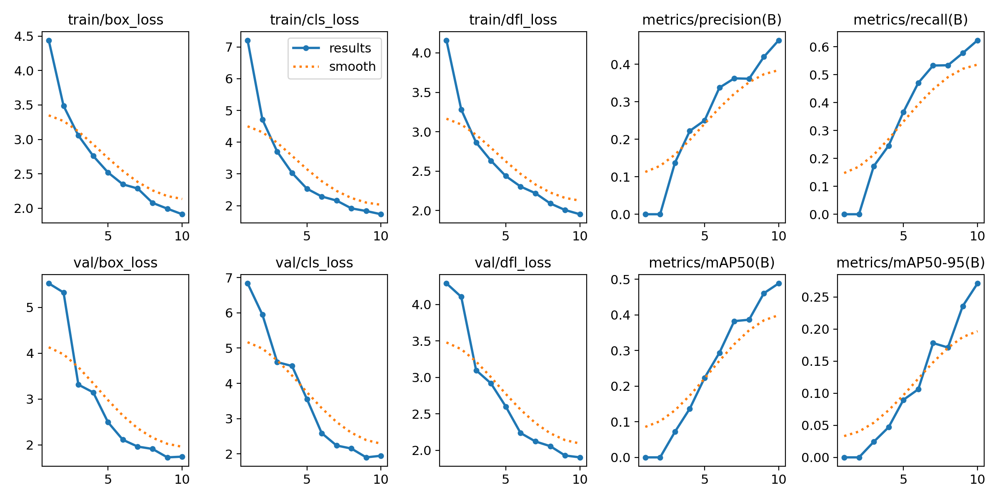
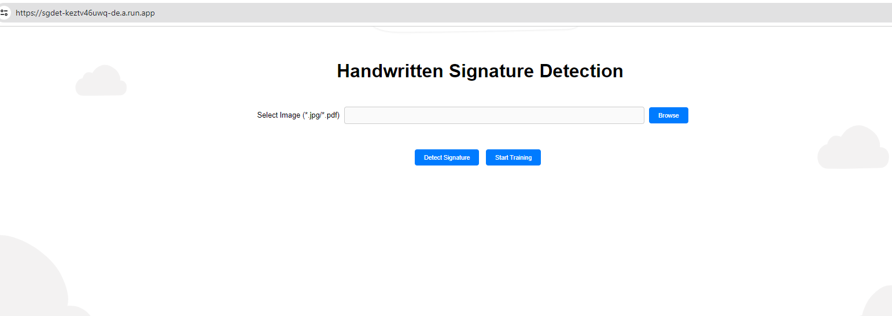

# Handwritten Signature Detection using Yolo8 model

"Sgdet" is a [simple](https://sgdet-keztv46uwq-de.a.run.app/) application that renders a webpage to input the pdf or image to detect the signature.

### Training - YOLO v8 model 
1. model.train(data="tobacco_data.yaml", epochs=10)  
2. web page provides an interface to start training - but not recommend as it takes 3-4 hours 

----
### Results
 

---
## Web Page

1. Interface to input the pdf or image to detect the signature.

Contact : fdprojecthost@gmail.com or george.2114101705@mujonline.edu.in if you have any queries